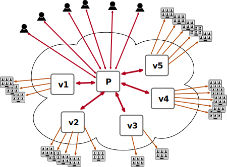

WARNING:This is still Work In Progress
The current implementation can diverge a lot. Currently only the participants after a configured threshold will be just viewers (visitors) and there is no promotion mechanism to become a main participant.
TODO: merge messaging between visitor nodes and main conference. Polls. Raise hand to be promoted to enter the main conference. Make sure it works with tenants.

# Low-latency conference streaming to very large audiences

To be able to have a low-latency conference with a large audience we need to take care of the media and signaling.
For a call with 10k participants you will need around 50 bridges on decent vms (8cores).
For the signaling part the main participants that share their video and audio are using the main prosody as every other conference.
But to accommodate the large audience we need several other prosodies which will be used by the participants and jicofo to invite them with the media session information.

For the example configuration we will use a 16 Core machine, so we can leave 8 of them for the main prosody and the rest (nginx, jicofo ...) and to run 8 additional prosodies for visitors.
We consider 2000 participants per visitor node a safe value. So 8 will be enough for one 10k participants meeting.



You can use the script pre-configure.sh to configure your system. Pass as only parameters the number of visitor prosodies to pre-configure.
`./pre-configure.sh 8`

The script will add for every one of them:
- create folders in /etc/
- add a systemd unit file in /lib/systemd/system/
- create a user for jicofo
- add its config to jicofo.conf

And configuration for the main prosody is a manual process.
- Add to the enabled modules list in the general part (e.g. [here](https://github.com/bjc/prosody/blob/76bf6d511f851c7cde8a81257afaaae0fb7a4160/prosody.cfg.lua.dist#L33)):
```
      "s2s_bidi";
      "certs_s2soutinjection";
      "s2soutinjection";
      "s2s_whitelist";
```

- Add the following config also in the general part (matching the number of prosodies you generated config for):
```
-- targets must be IPs, not hostnames
s2s_connect_overrides = {
    ["conference.v1.meet.jitsi"] = { "127.0.0.1", 52691 };
    ["conference.v2.meet.jitsi"] = { "127.0.0.1", 52692 };
    ["conference.v3.meet.jitsi"] = { "127.0.0.1", 52693 };
    ["conference.v4.meet.jitsi"] = { "127.0.0.1", 52694 };
    ["conference.v5.meet.jitsi"] = { "127.0.0.1", 52695 };
    ["conference.v6.meet.jitsi"] = { "127.0.0.1", 52696 };
    ["conference.v7.meet.jitsi"] = { "127.0.0.1", 52697 };
    ["conference.v8.meet.jitsi"] = { "127.0.0.1", 52698 };
}
-- allowed list of server-2-server connections
s2s_whitelist = {
    "conference.v1.meet.jitsi", "conference.v2.meet.jitsi", "conference.v3.meet.jitsi", "conference.v4.meet.jitsi",
    "conference.v5.meet.jitsi", "conference.v6.meet.jitsi", "conference.v7.meet.jitsi", "conference.v8.meet.jitsi"
};
```

- Make sure s2s is not in modules_disabled
- Enable `"xxl_conference";` module under the main virtual host (e.g. [here](https://github.com/jitsi/jitsi-meet/blob/f42772ec5bcc87ff6de17423d36df9bcad6e770d/doc/debian/jitsi-meet-prosody/prosody.cfg.lua-jvb.example#L57))

After configuring you can set the maximum number of main participants, before redirecting to visitors.
hocon -f /etc/jitsi/jicofo/jicofo.conf set "jicofo.visitors.max-participants" 3
Now restart prosody(service prosody restart) and jicofo(service jicofo restart).

Now after the main 3 participants joining, the rest will be visitors using the visitor nodes.
