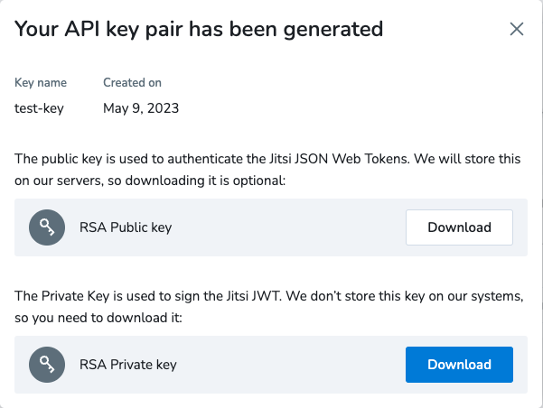
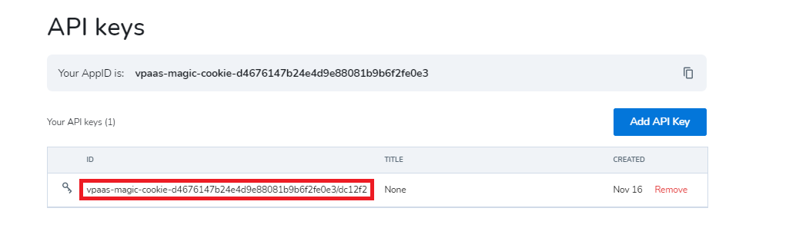

## How to switch your deployment to [JaaS](https://jaas.8x8.vc) in one easy step

Note: By default it will have e2ee(end-to-end) encryption enabled that works only on chromium based browsers (Chrome, Edge, ...). If a participant joins from another browser or mobile the e2ee is turned off. 

In order to use your deployment with JaaS you first need to login to your [JaaS Developer console](https://jaas.8x8.vc/#/apikeys) and generate a key pair.
Use `Add API key` button and then `Generate API key pair`. Make sure you download the generated private key from:



Make sure you transfer this downloaded private key to your server. Copy the key id from:



Now on your server run the helper script passing the private key file and the key id:

```
sudo /usr/share/jitsi-meet/scripts/move-to-jaas.sh /my/path/test-key.pk <key_id>
```

More information about JaaS Api keys at: https://developer.8x8.com/jaas/docs/jaas-console-api-keys

If you want to adjust the enabled services you can do that in /etc/jits/meet/jaas/nginx-jaas.conf. The part after `proxy_set_body` is the jwt token content that will be used for the client tokens. More info about the JaaS tokens: https://developer.8x8.com/jaas/docs/api-keys-jwt
