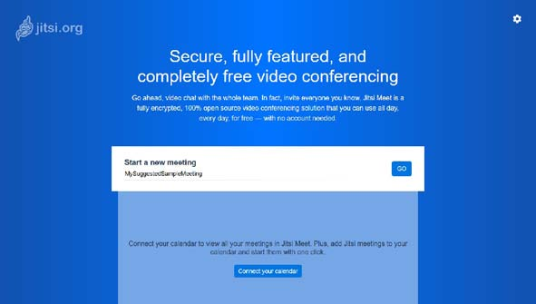
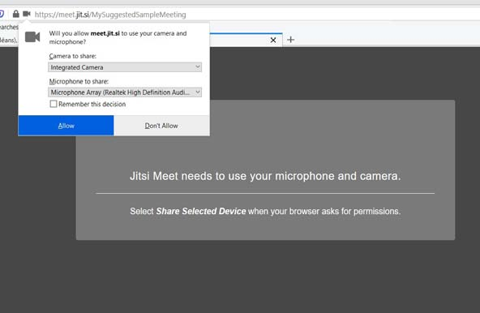
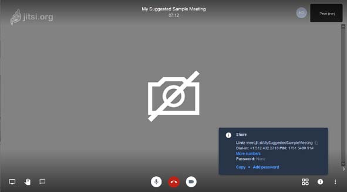

# Guía de usuario

| Guía basada en la versión inglesa de la guía creada por [Peter E. Humphries](https://community.jitsi.org/u/phumphries/summary): [https://community.jitsi.org/t/end-user-web-conference-guide-for-jitsi/28974](https://community.jitsi.org/t/end-user-web-conference-guide-for-jitsi/28974) |
| ------------- |

## Introducción

Tú puedes crear o atender a reuniones en Jitsi desde tu navegador o desde la aplicación de Jitsi en un dispositivo móvil.

Para más información sobre Jitsi Meet, puedes ir a [https://jitsi.org/](https://jitsi.org/). Haz clic en "See it in Action! Start a meeting" para crear una nueva reunión.

Jitsi puede gestionar hasta 75 participants en una sala. Para un número mayor de participantes, Jitsi ofrece integración con el servicio de transmisiones en directo de YouTube.

## Crear una reunión

* Ver a https://meet.jit.si/ o haz clic en "See it in Action! Start a meeting" en la página principal de Jitsi, [https://jitsi.org/](https://jitsi.org/). Puedes añadir ?lang=es-es a la URL o utilizar el menú de Ajustes () para cambiar el idioma en que se visualiza Jitsi Meet.

* Escribe un nombre para tu sala, o deja el nombre generado con palabras aleatorias. 

* Haz clic en el botón "IR" ("GO" si te aparece en inglés).

* El navegador puede pedir permiso para acceder a tu cámara y micrófono. Puede ser que necesites activar tu cámara y/o micrófono si están desactivados.

* Tu "sala" está abierta! Haz clic en "Copiar" en el diálogo informativo que aparece para copiar todos los detalles de la reunión, una invitación completa para compartir (por email, un chat, ...). Si solo quieres copiar el enlace a la reunión, usa el icono copiar () al lado del enlace.

