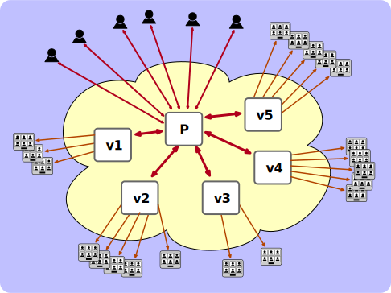

WARNING: This is still a Work In Progress

The final implementation may diverge. Currently, only the participants after a
configured threshold will be just viewers (visitors) and there is no promotion
mechanism to become a main participant yet.

TODO:
* Polls
* Speaker stats
* call duration

# Low-latency conference streaming to very large audiences

To have a low-latency conference with a very large audience, the media and
signaling load must be spread  beyond what can be handled by a typical Jitsi
installation. A call with 10k participants requires around 50 bridges on decent
vms (8+ cores). The main participants of a conference with a very large
audience will share a main prosody, like with normal conferences, and
additional prosody vms are needed to support signaling to the audience.

In the example configuration we use a 16 core machine. Eight of the cores are
used for the main prosody and other services (nginx, jicofo, etc) and the other
eight cores are used to run prosody services for visitors, i.e., "visitor
prosodies".

We consider 2000 participants per visitor node a safe value. So eight visitor
prosodies will be enough for one 10k participants meeting.



# Configuration
If using older than Prosody 0.12.4 you need to apply the patch - s2sout_override1.patch and s2sout_override2.patch.
Use the `pre-configure.sh` script to configure your system, passing it the
number of visitor prosodies to set up.
`./pre-configure.sh 8`

The script will add for each visitor prosody:
- folders in `/etc/`
- a systemd unit file in `/lib/systemd/system/`
- a user for jicofo
- a config entry in jicofo.conf

Setting up configuration for the main prosody is a manual process:
- Add to the enabled modules list in the general part (e.g. [here](https://github.com/bjc/prosody/blob/76bf6d511f851c7cde8a81257afaaae0fb7a4160/prosody.cfg.lua.dist#L33)):
```
      "s2s_bidi";
      "certs_s2soutinjection";
      "s2sout_override";
      "s2s_whitelist";
```

- Add the following config also in the general part (matching the number of prosodies you generated config for):
```
-- targets must be IPs, not hostnames
s2sout_override = {
    ["conference.v1.meet.jitsi"] = "tcp://127.0.0.1:52691";
    ["v1.meet.jitsi"] = "tcp://127.0.0.1:52691"; -- needed for v1.meet.jitsi->visitors.jitmeet.example.com
    ["conference.v2.meet.jitsi"] = "tcp://127.0.0.1:52692";
    ["v2.meet.jitsi"] = "tcp://127.0.0.1:52692";
    ["conference.v3.meet.jitsi"] = "tcp://127.0.0.1:52693";
    ["v3.meet.jitsi"] = "tcp://127.0.0.1:52693";
    ["conference.v4.meet.jitsi"] = "tcp://127.0.0.1:52694";
    ["v4.meet.jitsi"] = "tcp://127.0.0.1:52694";
    ["conference.v5.meet.jitsi"] = "tcp://127.0.0.1:52695";
    ["v5.meet.jitsi"] = "tcp://127.0.0.1:52695";
    ["conference.v6.meet.jitsi"] = "tcp://127.0.0.1:52696";
    ["v6.meet.jitsi"] = "tcp://127.0.0.1:52696";
    ["conference.v7.meet.jitsi"] = "tcp://127.0.0.1:52697";
    ["v7.meet.jitsi"] = "tcp://127.0.0.1:52697";
    ["conference.v8.meet.jitsi"] = "tcp://127.0.0.1:52698";
    ["v8.meet.jitsi"] = "tcp://127.0.0.1:52698";
}
-- allowed list of server-2-server connections
s2s_whitelist = {
    "conference.v1.meet.jitsi", "conference.v2.meet.jitsi", "conference.v3.meet.jitsi", "conference.v4.meet.jitsi",
    "conference.v5.meet.jitsi", "conference.v6.meet.jitsi", "conference.v7.meet.jitsi", "conference.v8.meet.jitsi"
};
```

- Make sure s2s is not in modules_disabled
- Enable `"visitors";` module under the main virtual host (e.g. [here](https://github.com/jitsi/jitsi-meet/blob/f42772ec5bcc87ff6de17423d36df9bcad6e770d/doc/debian/jitsi-meet-prosody/prosody.cfg.lua-jvb.example#L57))
  You can add under main virtual host the config: `visitors_ignore_list = { "recorder.jitmeet.example.com" }` to ignore jibri and transcribers from the visitor logic and use them only in the main prosody conference.
- Create the visitors component in /etc/prosody/conf.d/jitmeet.example.com.cfg.lua:
```
Component "visitors.jitmeet.example.com" "visitors_component"
  auto_allow_visitor_promotion = true
  admins = { "focus@auth.jitmeet.example.com" }
```
- Make sure you add the correct upstreams to nginx config
```
upstream v1 {
    zone upstreams 64K;
    server 127.0.0.1:52801;
    keepalive 2;
}
upstream v2 {
    zone upstreams 64K;
    server 127.0.0.1:52802;
    keepalive 2;
}
```

After configuring you can set the maximum number of main participants, before
redirecting to visitors.
```
hocon -f /etc/jitsi/jicofo/jicofo.conf set "jicofo.visitors.enabled" true
hocon -f /etc/jitsi/jicofo/jicofo.conf set "jicofo.visitors.max-participants" 30
```
Now restart prosody and jicofo
```
service prosody restart
service jicofo restart
service nginx restart
```

Now after the main 30 participants join, the rest will be visitors using the
visitor nodes.

To enable promotion where visitors need to be approved by a moderator to join the meeting:
  - you need to switch `auto_allow_visitor_promotion=false`.
  - You need to enable http requests to jicofo by editing config.js and adding a nginx rule for it. 
    - In /etc/jitsi/meet/jitmeet.example.com-config.js uncomment conferenceRequestUrl.
    - In jitsi-meet nginx config make sure you have the conference-request location rules.
