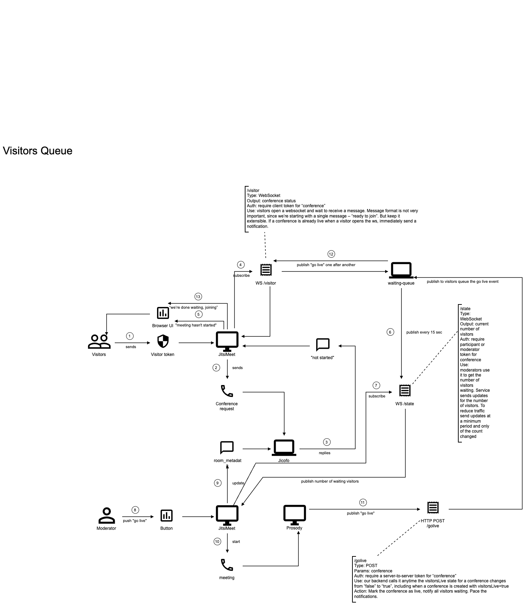
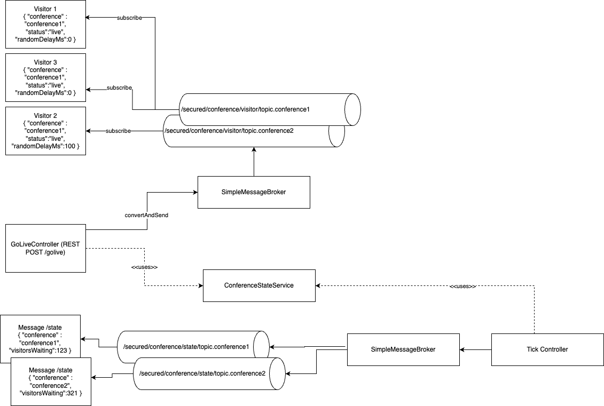

# Waiting queue

Visitors queue service is used for managing the visitors queue for the 8x8 video meetings by keeping visitors websocket connections opened and when a moderator opens the meeting, the visitors are notified and allowed to join the meeting.
The moderators should be able to see the visitors count.

## Authentication

The JWT token is sent at least in the CONNECT STOMP message as connect header - see sample code:

```
headers = {
        Authorization: 'Bearer ' + token
    };

    stompClient.connectHeaders = headers;

    stompClient.onConnect = (frame) => {
        setConnected(true);
        console.log('Connected: ' + frame);

        stompClient.subscribe('/secured/conference/visitor/topic.' + conference, (message) => {
            showMessage(message.body);
        }, headers);
    };
```

### Visitors

This endpoint should accept only visitor's jaas tokens for a conference specified as param to the endpoint and the token to be valid for that room. The token for visitors contains:
```
context: {
    user: {
        role: ‘visitor'
    }
}
```
It allows visitors to connect to the /visitors websocket and wait for the start message to be published on /secured/conference/visitor/topic.{conference} topic.

### Moderators

This endpoint should accept only moderator's jaas tokens for a conference specified as param to the endpoint and the token to be valid for that room. The token for moderator contains:
```
context: {
    user: {
        moderator: true
    }
}
```
It allows moderators to connect to the /moderator websocket and wait for the status message to be published on /secured/conference/state/topic.{conference} topic (triggered every 15 seconds).

## Flow

The flow is depicted below:



## Topics

The topics used:



## API

| Endpoint   |      Type      |  Auth | Use |
|----------|:-------------:|------:|------:|
| WS /visitor |  WebSocket/STOMP | require client token for conference | Visitors open a websocket and wait to receive a message. Message format is not very important, since we’re starting with a single message – “ready to join”. But keep it extensible. If a conference is already live when a visitor opens the ws, immediately send a notification | 
| WS /state |    WebSocket/STOMP   |   require client token for conference | Moderators use it to get the number of visitors waiting. Service sends updates for the number of visitors. To reduce traffic send updates at a minimum period and only if the count changed |
| POST /golive | REST | require a server-to-server token for conference | Our backend calls it anytime the visitorsLive state for a conference changes from “false” to “true”, including when a conference is created with visitorsLive=true |

>
> Note: CONNECT and MESSAGE STOMP frames expect an additional header for Authorization
>

More on [STOMP](https://stomp.github.io/stomp-specification-1.2.html).

## Sample code

There is sample code showing how to handle the visitor case [here](./examples/visitor.js).