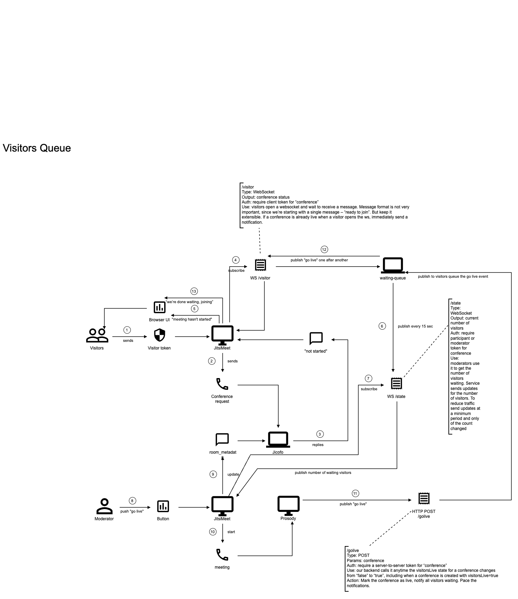
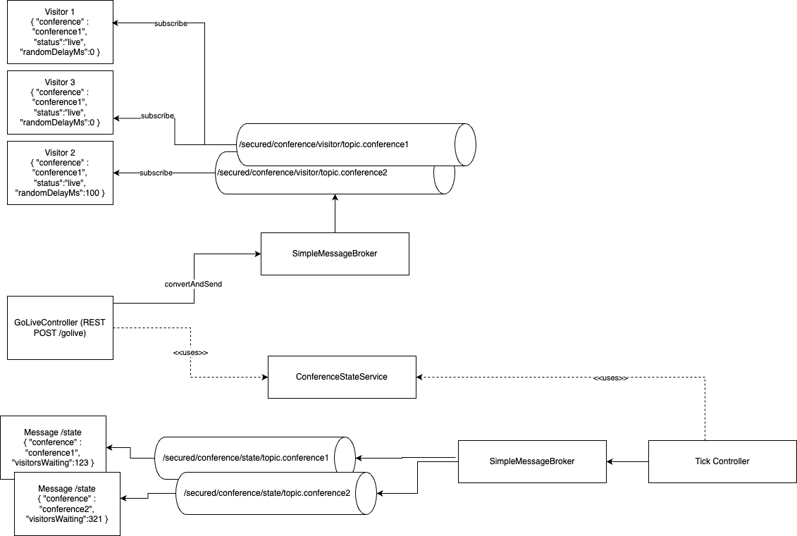

# Waiting queue

Visitors queue service is used for managing the visitors queue for Jitsi Meet meetings by keeping visitors websocket connections opened and when a moderator opens the meeting, the visitors are notified and allowed to join the meeting.
The moderators should be able to see the visitors count.

## Authentication

The JWT token is sent at least in the CONNECT STOMP message as connect header - see sample code:

```
headers = {
        Authorization: 'Bearer ' + token
    };

    stompClient.connectHeaders = headers;

    stompClient.onConnect = (frame) => {
        setConnected(true);
        console.log('Connected: ' + frame);

        stompClient.subscribe('/secured/conference/visitor/topic.' + conference, (message) => {
            showMessage(message.body);
        }, headers);
    };
```

### Visitors

This endpoint should accept only visitor's JWT tokens for a conference specified as param to the endpoint and the token to be valid for that room. The token for visitors contains:
```
context: {
    user: {
        role: ‘visitor'
    }
}
```
It allows visitors to connect to the /visitors websocket and wait for the start message to be published on /secured/conference/visitor/topic.{conference} topic.

### Moderators

This endpoint should accept only moderator's JWT tokens for a conference specified as param to the endpoint and the token to be valid for that room. The token for moderator contains:
```
context: {
    user: {
        moderator: true
    }
}
```
It allows moderators to connect to the /moderator websocket and wait for the status message to be published on /secured/conference/state/topic.{conference} topic (triggered every 15 seconds).

### Visitors list

The service can also provide the list of visitors (id and display name) that are currently in the meeting, so that it can be shown in the participants pane ("Viewers").

#### How the service learns about visitors

The service needs to know when a visitor joins or leaves the meeting. Visitors join rooms on the visitor prosody nodes, so a prosody module loaded on those nodes can report it. For example, it can hook `muc-occupant-joined` and `muc-occupant-left` and send an event to the service for every visitor. How the event is delivered (HTTP request, message queue, ...) is up to the implementation.

For every event, the service needs:
- The meeting id: `room._data.meetingId`, set by `mod_muc_meeting_id`. The rooms on the visitor nodes have the same value as the main room. The client gets the same value from `conference.getMeetingUniqueId()`.
- The visitor id: the occupant's nick (the resource of `occupant.nick`). This is the participant's endpoint id in the conference.
- The display name: the `nick` element (`http://jabber.org/protocol/nick`) from the occupant's presence, which holds the name from the pre-join screen. If there is none, the name from the token can be used. The leave presence may not carry the name, so keep the name from the join event.
- Whether the visitor joined or left.

The service keeps the current list for every meeting and the changes since the last update. It can drop a meeting's list when the main room is destroyed.

#### Who can get the list

The client uses the list only when both are true:
- `config.visitors.queueService` is set.
- The participant's JWT has the `list-visitors` feature set to `true`. The client treats it as off when it is missing, also when `features` is missing from the token:
```
context: {
    features: {
        'list-visitors': true
    }
}
```

The service should check the token sent on CONNECT (and on SUBSCRIBE, if it has an `Authorization` header) and allow subscribing to the visitors list destinations only for tokens that have this feature and are valid for that meeting.

#### Websocket

The client connects to `wss://{queueService}/visitors-list/websocket` with the `Authorization: Bearer <token>` CONNECT header. There are two destinations:

| Destination | Use |
|----------|------:|
| `/secured/conference/visitors-list/queue/{meetingId}/{participantId}` | When the client subscribes, the service sends the full list once |
| `/secured/conference/visitors-list/topic/{meetingId}` | The service sends the changes (visitors joining or leaving) to all subscribers of the meeting |

Where:
- `{meetingId}` is the meeting unique id. Unlike the other topics, it is not the conference JID.
- `{participantId}` is the endpoint id of the participant asking for the list. It makes the queue name unique for each participant, so the full list goes only to the participant that asked for it.

The full list sent on the queue is an array of visitors:
```
[
    { "n": "John", "r": "a1b2c3d4" },
    { "n": "Jane", "r": "e5f6a7b8" }
]
```

The changes sent on the topic are an array of updates. One message can have many updates, and they must be in the order they happened. The service can group the changes and send them at a fixed period (every few seconds), so that a meeting with many visitors does not produce a message for every join and leave:
```
[
    { "n": "Bob", "r": "c9d0e1f2", "s": "j" },
    { "n": "John", "r": "a1b2c3d4", "s": "l" }
]
```

| Field | Meaning |
|----------|------:|
| `n` | The display name. It can be empty, and then the client shows `defaultRemoteDisplayName` |
| `r` | The visitor id (its endpoint id). The client uses it as the participant id |
| `s` | Only in topic updates: `j` - joined (add the visitor, or update its name if it is already in the list), `l` - left (remove the visitor) |

#### Client behaviour

The client:
1. Subscribes to the topic first and keeps any updates it receives in a buffer, so no change is lost while it waits for the full list.
2. Then subscribes to the queue. When the full list arrives, the client replaces its whole list with it and unsubscribes from the queue. Then it applies the buffered updates in order.
3. Applies every later topic update to its local list.

Because of this, an update that is already part of the full list may be applied again. That is fine: a `j` for a visitor already in the list only updates its name, and an `l` for a visitor not in the list does nothing.

The subscription is lazy. It starts only when the "Viewers" section in the participants pane is expanded or a search is typed there. The section is shown only when the visitors count from the conference is more than 0. Only one connection is open at a time. The connection is closed when the participant leaves the conference. After more than 3 connection errors, the client stops trying. The visitors list is web only for now.

## Flow

The flow is depicted below:



## Topics

The topics used:



## API

| Endpoint   |      Type      |  Auth | Use |
|----------|:-------------:|------:|------:|
| WS /visitor |  WebSocket/STOMP | require client token for conference | Visitors open a websocket and wait to receive a message. Message format is not very important, since we’re starting with a single message – “ready to join”. But keep it extensible. If a conference is already live when a visitor opens the ws, immediately send a notification | 
| WS /state |    WebSocket/STOMP   |   require client token for conference | Moderators use it to get the number of visitors waiting. Service sends updates for the number of visitors. To reduce traffic send updates at a minimum period and only if the count changed |
| WS /visitors-list |    WebSocket/STOMP   |   require client token for conference with `list-visitors` feature | Participants use it to get the list of visitors currently in the meeting. The full list is sent once on `/secured/conference/visitors-list/queue/{meetingId}/{participantId}`. Changes are sent on `/secured/conference/visitors-list/topic/{meetingId}`. See [Visitors list](#visitors-list) |
| POST /golive | REST | require a server-to-server token for conference | Our backend calls it anytime the visitorsLive state for a conference changes from “false” to “true”, including when a conference is created with visitorsLive=true |

>
> Note: CONNECT and MESSAGE STOMP frames expect an additional header for Authorization
>

More on [STOMP](https://stomp.github.io/stomp-specification-1.2.html).

## Sample code

There is sample code showing how to handle the visitor case [here](./examples/visitor.js).